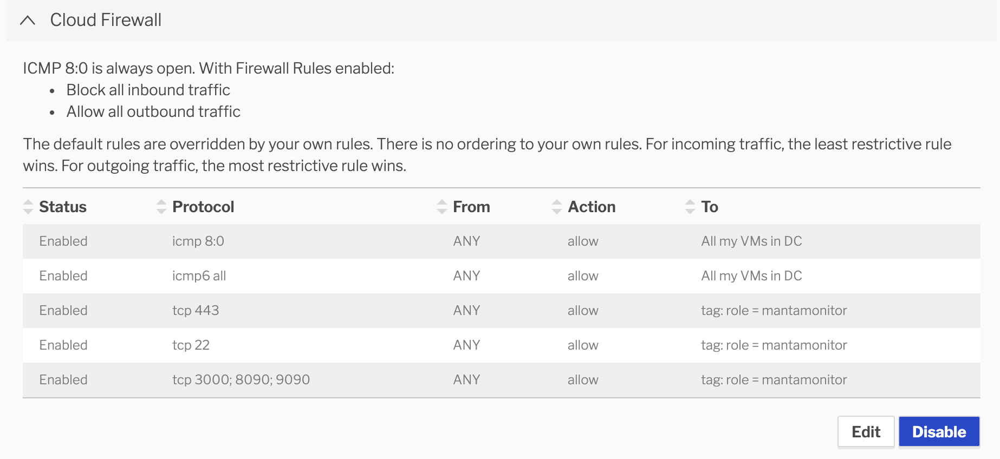

## Introduction

The purpose of this tool is to allow the users of [manta-monitor](https://github.com/joyent/manta-monitor)
to quickly deploy the application along with [prometheus](https://prometheus.io/docs/introduction/overview/)
and [grafana](https://grafana.com/docs/guides/getting_started/) in a containerized environment
that makes it easy for dev and functional testing of the manta object store.
The goal is to make it easy for the manta engineers to observe latency metrics
exposed by manta-monitor, in grafana, and quickly test the improvements.

## Pre-requisites
In order to be able to use this tool make sure you have:
* For MAC:
    * [docker-compose](https://docs.docker.com/compose/install/) installed. Follow the link to install [docker for mac](https://docs.docker.com/docker-for-mac/install/).
      The docker-compose is included in the installation.
* For LINUX:
    * [docker-compose](https://docs.docker.com/compose/install/) installed. 
      For eg, on an Ubuntu KVM run:
      
      ``` # sudo apt install docker-compose ```
      
The following applies to both the OS:
* Environment variables: Make sure you have exported the relevant MANTA env variables as:

``` 
export MANTA_USER=qauser
export MANTA_PUBLIC_KEY=$(cat $HOME/.ssh/id_rsa.pub)
export MANTA_PRIVATE_KEY=$(cat $HOME/.ssh/id_rsa | base64 -b0) #FOR MAC
                OR
export MANTA_PRIVATE_KEY=$(cat $HOME/.ssh/id_rsa | base64 -w0) #FOR LINUX
export MANTA_URL=https://us-east.manta.joyent.com

```
* [Honeybadger](https://github.com/joyent/manta-monitor/blob/master/doc/manta-monitor-deployment.md#honeybadger) api key.
  This is OPTIONAL. By default, the tool will not report any errors to [Honeybadger](https://www.honeybadger.io/), but
  if you want to keep a track of errors and exceptions arising out of the application, then you can create a free trail
  account which is valid for 30 days. Once you create the account use the API Key under the user's setting and
  use that value for setting the HONEYBADGER_API_KEY environment variable under the environments section of the
  manta_monitor service in the [docker compose file](docker-compose.yml).
  
* [Manta Monitor Config](./manta-monitor-config.json). This json file is used by manta-monitor to configure the test load.
  By default, it is configured to test 'buckets', however, changing the 'test_type' key in the ```manta-monitor-config.json```
  to 'dir' will configure the application to test manta directories. You can upload your config file to the MANTA_USER's 
  stor and make it available to the application.
  
   ```
    mput -f manta-monitor-config.json ~~/stor/
    ```
  OR
  
  Use [docker-compose volumes](https://docs.docker.com/compose/compose-file/compose-file-v2/#volume-configuration-reference)
  to mount the config file inside the container to make it available for the application by adding the following below *ports*
  in the manta-monitor service in the docker-compose.yml:
  ```
  services:
    manta-monitor:
      image: joyent/manta-monitor:buckets
      container_name: "manta-monitor"
      tmpfs:
        - /opt/manta-monitor/tmp
      logging:
        driver: "json-file"
        options:
          max-size: "10m"
          max-file: "3"
      ports:
        - 8090:8090
      volumes:
        - ./manta-monitor-config.json:/opt/manta-monitor/manta-monitor-config.json
      environment:
        - JAVA_ENV=development
        - HONEYBADGER_API_KEY=""
        - CONFIG_FILE=/opt/manta-monitor/manta-monitor-config.json
        - MANTA_USER=$MANTA_USER
        - MANTA_URL=$MANTA_URL
        - MANTA_PUBLIC_KEY=$MANTA_PUBLIC_KEY
        - MANTA_PRIVATE_KEY=$MANTA_PRIVATE_KEY
        - MANTA_TIMEOUT=4000
        - MANTA_METRIC_REPORTER_MODE=JMX
        - MANTA_HTTP_RETRIES=3
        - JETTY_SERVER_PORT=8090
        - ENABLE_TLS=false
        - MANTA_TLS_INSECURE=1
  ```
  
## Usage

### OPTION 1: Run on your laptop

Make sure you have met the pre-requisites from the above. Confirm the details in the docker-compose.yml file and make 
sure that the MANTA_URL endpoint can be reached from your laptop.

```
$ docker-compose up -d
```
The above command will pull the required images from the docker hub repository and start the containers.

### OPTION 2: Run on a KVM

You can provision a KVM in JPC and install the pre-requisites. The following is an example:




Confirm the details in the docker-compose.yml file and make sure that the MANTA_URL endpoint can be reached from the KVM.

Start the containers

```
# docker-compose up -d
```
You can check the running status of the containers as:

```
$ docker ps -a
```
OR 

```
$ docker-compose ps
```

For any reason, if the container/s exit out then you can check the logs as:

```
$ docker-compose logs manta-monitor
``` 
where manta-monitor is the name of the service as defined in the docker-compose.yml.

The service *prometheus* is configured with a default configuration file [prometheus.yaml](prometheus/prometheus.yaml).
It is configured to scrape the manta-monitor metrics.

The service *grafana* is configured to pre-install [dashboards](grafana/dashboards) that contains graphs to help look at 
some latency metrics right out of the box.


## Inspect the output
Open grafana UI in the browser http://localhost:3000.
The default userid and password is admin/admin.

